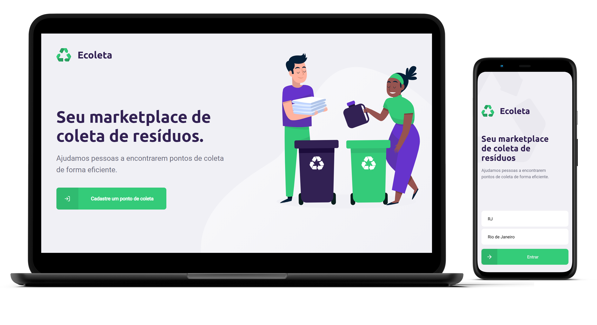
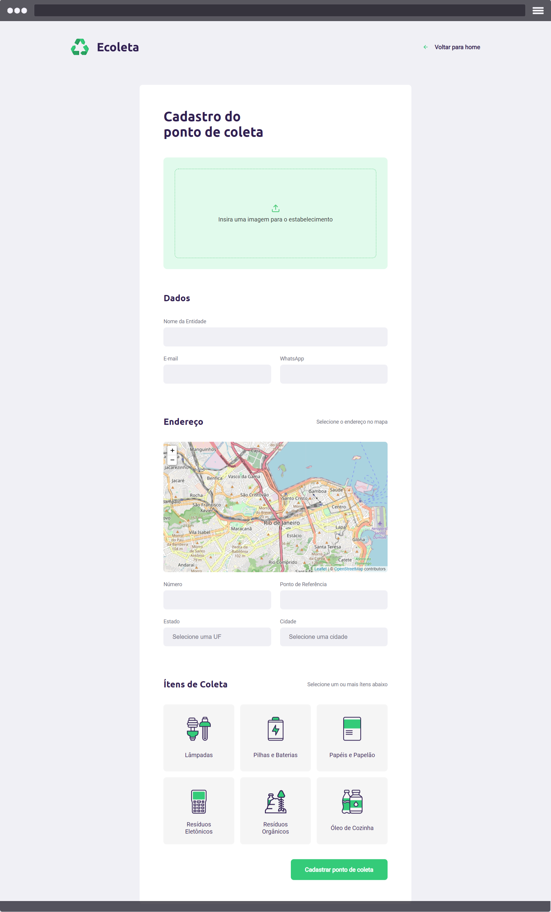

<h1 align="center"></h1>

<h2>
  
   
  
   
  
</h2>

	
  

   

"ECOLETA" Projeto desenvolvido durante a <b> Next Level Week #01 [ NLW ]</b> oferecida pela <a href="https://rocketseat.com.br/">Rocketseat</a>.

A aplicação é uma solução simples para conectar empresas que coletam resíduos à pessoas interessadas em fazer descarte responsável do seu lixo.

O desafio de desenvolvimento da aplicação caiu na "Semana Mundial do Meio Ambiente" - Que tem o Dia Mundial do Meio Ambiente, comemorado no dia 5 de junho. A data foi instituída pela Organização das Nações Unidas (ONU), e tem como objetivo principal chamar a atenção de todas as esferas da população para os problemas ambientais e para a importância da preservação dos recursos naturais, que até então eram considerados, por muitos, inesgotáveis. Ou seja, o contexto de desenvolvimento do projeto estava super alinhado com um momento muito importante e de interesse de todos nós. 

### Descrição

O <b>"Ecoleta"</b> é uma solução simples para conectar empresas que coletam resíduos à pessoas interessadas em fazer descarte responsável do seu lixo. 

### Tecnologias

- [TypeScript](https://github.com/Microsoft/TypeScript)
- [Express](https://github.com/expressjs/express)
- [React](https://github.com/facebook/react)
- [React Native](https://github.com/facebook/react-native)
- [React-Leaflet](https://github.com/PaulLeCam/react-leaflet)
- [Expo](https://github.com/expo/expo)
- [Knex](http://knexjs.org/)
- [Multer](https://www.npmjs.com/package/multer)
- [SQLite3](https://www.sqlite.org/index.html)

### Ferramentas

[ APLICAÇÃO TESTADA EM DEVICES REAIS ]

- [Visual Studio Code](https://code.visualstudio.com)
- [Insomnia](https://insomnia.rest)
- [Expo](https://expo.io/)

### Layout da aplicação

O layout da aplicação e app podem ser encontrados no link: [Figma](<https://www.figma.com/file/9TlOcj6l7D05fZhU12xWT3/Ecoleta-(Booster)>).

### Melhorias

- Controle de acesso de usuários;

- Painel de administração;

- Complemento de dados para endereço completo;

- Melhoria na responsividade da página de cadastro de pontos de coleta;

- Refinamento de código;

- Documentação;

- Testes.

### Agradecimentos
Obrigado, [Rocketseat]( https://github.com/Rocketseat) pela iniciativa. O projeto foi um desafio, mas, ao mesmo tempo, incrível. Não estava nos meus planos participar, mas a elegância do design e o tema chamaram muito minha atenção. Parabéns por compartilher conhecimento.